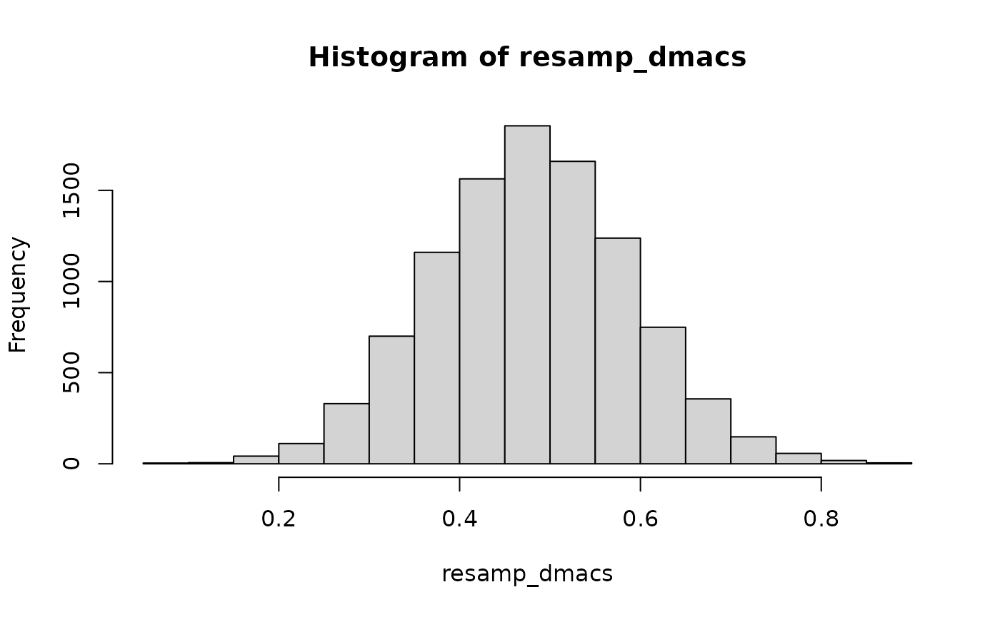

# Confidence Intervals for dMACS

``` r

library(pinsearch)
library(lavaan)
#> This is lavaan 0.7-2
#> lavaan is FREE software! Please report any bugs.
set.seed(1131)
```

## Effect Size for Noninvariance

``` r

mod <- "
  visual  =~ x1 + x2 + x3
  textual =~ x4 + x5 + x6
  speed   =~ x7 + x8 + x9
"
# Output the final partial invariance model, and the noninvariant items
ps1 <-
    pinSearch(mod,
        data = HolzingerSwineford1939,
        group = "school", type = "residuals",
        effect_size = TRUE
    )
ps1
#> $`Partial Invariance Fit`
#> lavaan 0.7-2 ended normally after 64 iterations
#> 
#>   Estimator                                         ML
#>   Optimization method                           NLMINB
#>   Number of model parameters                        66
#>   Number of equality constraints                    25
#> 
#>   Number of observations per group:                   
#>     Pasteur                                        156
#>     Grant-White                                    145
#> 
#> Model Test User Model:
#>                                                       
#>   Test statistic                               147.260
#>   Degrees of freedom                                67
#>   P-value (Chi-square)                           0.000
#>   Test statistic for each group:
#>     Pasteur                                     79.438
#>     Grant-White                                 67.823
#> 
#> $`Non-Invariant Items`
#>   group lhs rhs       type
#> 1     1  x3     intercepts
#> 2     1  x7     intercepts
#> 
#> $effect_size
#>       x3-visual  x7-speed
#> dmacs 0.4866004 0.4161171
```

## Confidence Intervals with Resampling

### Monte Carlo Methods

``` r

# Extract the parameter estimates for dmacs input
lav_free <- lavInspect(ps1[[1]])
# Index of the input parameters (item 3)
input_ind <- c(
    lav_free[[1]]$lambda[3, 1],
    lav_free[[1]]$nu[3, 1],
    lav_free[[2]]$nu[3, 1],
    lav_free[[1]]$theta[3, 3]
)
input_coef <- coef(ps1[[1]])[input_ind]
# Wrapper for computing dmacs with the input
my_dmacs <- function(x) {
    dmacs(
        intercepts = matrix(x[2:3]),
        loadings = matrix(x[1], nrow = 2),
        uniqueness = matrix(x[4], nrow = 2),
        ns = c(156, 145)
    )
}
# Note the effect size is slightly different
# using implied SD
my_dmacs(input_coef)
#> Pooled item SD is computed based on the input parameters
#>            [,1]
#> dmacs 0.4794302
```

``` r

# Resample coefficients
num_resamp <- 10000
resamp_coef <- MASS::mvrnorm(
    n = num_resamp,
    mu = input_coef,
    Sigma = vcov(ps1[[1]])[input_ind, input_ind]
)
# Resampled distribution of dmacs
resamp_dmacs <- apply(resamp_coef, 1, my_dmacs)
```

``` r

hist(resamp_dmacs)
```



Bias correction

``` r

# Estimate bias
bias <- mean(resamp_dmacs) - my_dmacs(input_coef)
#> Pooled item SD is computed based on the input parameters
# Bias corrected dMACS
my_dmacs(input_coef) - bias
#> Pooled item SD is computed based on the input parameters
#>            [,1]
#> dmacs 0.4794864
```

Confidence Intervals

``` r

# 95% Percentile CI
quantile(resamp_dmacs, c(.025, .975))
#>      2.5%     97.5% 
#> 0.2679530 0.6969747
```

### Nonparametric Bootstrap

``` r

boot_dmacs <- bootstrapLavaan(ps1[[1]], R = 1000, FUN = pin_effsize)
```

``` r

# Bias
boot_bias <- colMeans(boot_dmacs, na.rm = TRUE) - ps1$effect_size
# Bias corrected dMACS
ps1$effect_size - boot_bias
#>       x3-visual  x7-speed
#> dmacs 0.4748794 0.4122325
# 95% Percentile CI
boot::boot.ci(
    structure(list(t0 = ps1$effect_size,
                   t = boot_dmacs,
                   R = 1000, class = "boot")),
    type = c("norm", "basic", "perc")
)
#> BOOTSTRAP CONFIDENCE INTERVAL CALCULATIONS
#> Based on 1000 bootstrap replicates
#> 
#> CALL : 
#> boot::boot.ci(boot.out = structure(list(t0 = ps1$effect_size, 
#>     t = boot_dmacs, R = 1000, class = "boot")), type = c("norm", 
#>     "basic", "perc"))
#> 
#> Intervals : 
#> Level      Normal              Basic              Percentile     
#> 95%   ( 0.2458,  0.7040 )   ( 0.2438,  0.6855 )   ( 0.2877,  0.7294 )  
#> Calculations and Intervals on Original Scale
```
