# pinsearch — Internal Dependency Graph

Generated from `R/` source (6 exported functions, v0.1.4.3).
Sole non-base hard dependency: **lavaan** (`stats`, `utils` are base R).

## Diagram

```mermaid
flowchart TD
    subgraph API [Exported]
        PIN["pinSearch<br/>pinSearch.R:168"]
        DM["dmacs<br/>dmacs.R:51"]
        DMO["dmacs_ordered<br/>dmacs.R:119"]
        FM["fmacs<br/>fmacs.R:63"]
        FMO["fmacs_ordered<br/>fmacs.R:160"]
        PE["pin_effsize = es_lavaan<br/>dmacs.R:374, alias at :465"]
    end

    subgraph SEARCH [Search machinery — used by pinSearch only]
        T2O["type2op"]
        CFA2["cfa2"]
        PTP["initialize_partable"]
        FDR["fdr_alpha"]
        GOV["get_ovnames (helper.R)"]
        RC["remove_cons<br/>remove_cons.R:1"]
        GI1["get_invmod"]
        GI2["get_invscore"]
        GI3["get_invlrt"]
    end

    subgraph ES [Effect-size plumbing]
        CHKC["check_inv -> getpt"]
        TML["to_mat_loadings"]
        TMT["to_mat_thresholds"]
        PSS["pooledsd_sampstat"]
        VFT["var_from_thres"]
        IPV["implied_pooledvar_linear"]
    end

    subgraph UTIL [Shared utils]
        WS["wsum"]
        SZL["suppress_zero_loadings"]
        PV["pooledvar"]
    end

    PIN --> CFA2 --> L1["lavaan::cfa"]
    PIN --> T2O
    PIN --> FDR
    PIN --> GOV
    PIN --> PTP
    PTP --> RC
    PTP --> T2O
    PIN --> GI1 & GI2 & GI3
    GI3 --> RC
    PIN -. "effect_size = TRUE" .-> PE
    PIN --> L2["lavaan::parTable / lavTestLRT"]
    GI1 --> L3["lavaan::modindices"]
    GI2 --> L4["lavaan::lavTestScore"]

    PE --> L5["lavaan::parTable / lavInspect"]
    PE --> CHKC
    PE --> TML
    PE --> TMT
    PE --> PSS
    PSS --> VFT
    PSS --> PV
    PE --> DM & DMO & FM & FMO

    DM --> WS & SZL
    DM --> IPV --> PV
    DMO --> WS & SZL
    FM --> WS & SZL
    FMO --> WS & SZL
    DM & DMO & FMO --> ST["stats: pnorm, plogis, integrate, dnorm, weighted.mean"]
    FM & FMO --> ST2["stats: contr.sum, contrasts<-, model.matrix"]
```

## Central nodes

- `pinSearch` — entrypoint; only caller of the search machinery.
- `remove_cons` — shared by `pinSearch` loop, `initialize_partable`, `get_invlrt`.
- `es_lavaan` (`pin_effsize`) — bridge from lavaan S4 objects to all 4 effect-size functions.
- `wsum` / `suppress_zero_loadings` / `pooledvar` — used by 2+ exported functions.
- The search and effect-size subsystems intersect only at `pinSearch -> es_lavaan`.

## Notes

- Dispatch: `pinSearch` picks `get_inv{mod,score,lrt}` via `inv_test`; `es_lavaan` picks `dmacs*`/`fmacs*` by group count (2 vs >2).
- `cfa2` is a thin wrapper so `do.call(cfa2, ...)` works; all fits go through `lavaan::cfa`.
- `es_lavaan` reads lavaan S4 slots `@pta$vnames` directly (`dmacs.R:376,411`).
- Dead code (defined, never called): `op2col` (pinSearch.R:15), `dmacs_pairwise` (dmacs.R:191), `get_lvnames` (helper.R:5).
